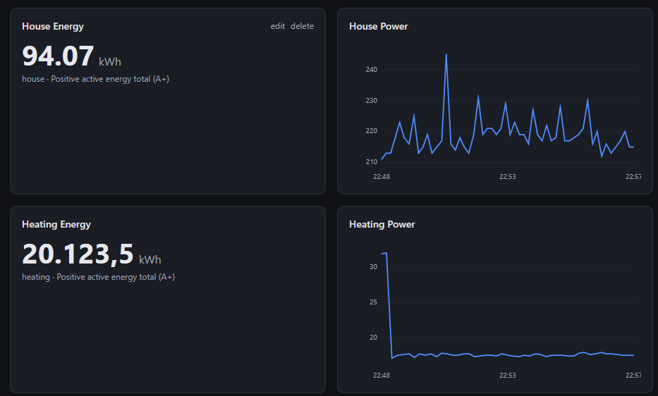
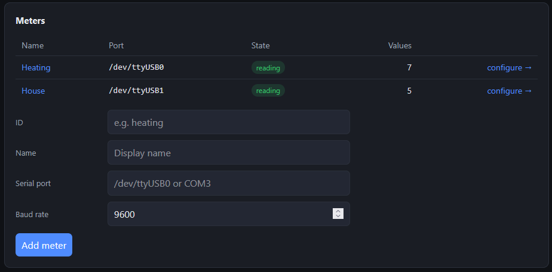
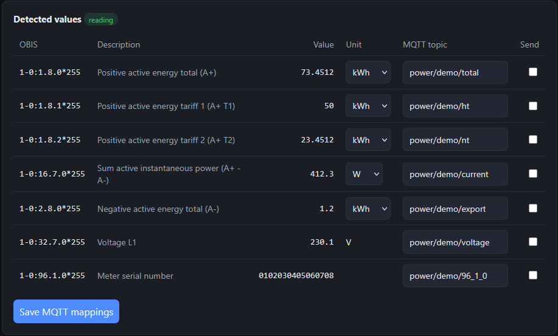
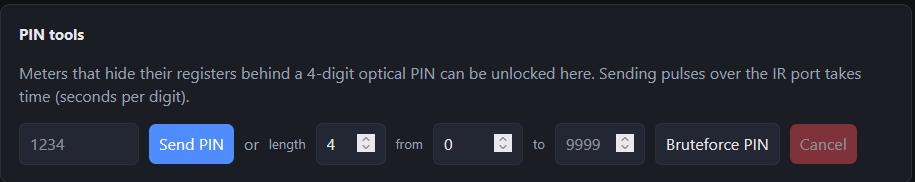

# smlgw — smart meter (SML/OBIS) → MQTT gateway

[](https://github.com/PhilippMundhenk/smlgw/actions/workflows/ci.yml)
[](https://github.com/PhilippMundhenk/smlgw/actions/workflows/docker-release.yml)
[](LICENSE)

A clean Python rewrite of an old Node `gateway.js`. It reads the **SML** protocol
from one or more smart meters over a serial/optical interface, decodes the
**OBIS** values, publishes them to **MQTT** (in the *exact same payload format*
as the legacy gateway), stores them as **time series**, and ships a
**Grafana-style web UI** to configure everything and plot history.



## Highlights

- **Resilient.** Each meter runs in its own worker thread with an independent
  reconnect loop — a meter that is offline at startup no longer stops the
  service (the central flaw of the old gateway).
- **Configurable dashboard (home).** Add Grafana-style panels — **line charts**,
  **single-stat** numbers and **gauges** — each bound to one or more
  (meter, OBIS) sources. Self-contained canvas rendering, no external JS.
- **History with configurable retention.** Every numeric reading is stored in
  SQLite; retention window and sample spacing are set on the Settings page.
- **Auto-discovery.** Whatever a meter transmits (e.g. a new `2.8.0` export
  register) appears in the UI, ready to be mapped to MQTT and plotted.
- **Settings page.** Central management of meters, the MQTT broker, history
  retention and an optional **UI password**.
- **PIN tools.** For meters that hide registers behind a 4-digit optical PIN,
  enter a known PIN or **bruteforce** a lost one — a clean reimplementation of
  the old `pin.sh`, detecting the unlock from the live SML stream.
- **Byte-for-byte MQTT compatibility** with the legacy gateway (including the
  Wh→kWh conversion — see [Legacy compatibility](#legacy-compatibility)).
- **Easy deployment**: Docker image on GHCR, `docker compose`, or native
  (systemd). CI on every push; images published automatically.
- **Runs on tiny hardware.** A deliberately **pure-Python** dependency set
  (Starlette + plain uvicorn, no pydantic/uvloop/httptools) and **Python 3.9+**,
  so `pip install` needs no Rust/C compilation even on an ARMv6 Raspberry Pi 1.

---

## Quick start (no hardware)

```bash
pip install .
smlgw run --simulate
# open http://localhost:8000
```

`--simulate` streams a synthetic three-phase meter through the whole pipeline —
decode → discover → publish → store — so you can explore the dashboard, add
panels and try the value→topic mapping without any hardware.

Or straight from the published container image:

```bash
docker run --rm -p 8000:8000 ghcr.io/philippmundhenk/smlgw:latest run --simulate
```

---

## Architecture

```
serial/optical ─▶ SmlStreamParser ─▶ OBIS values ─┬▶ per-meter mappings ─▶ MQTT
   (transport)      (sml/parser)       (obis.py)   │      (manager)        (publisher)
                                                    ├▶ HistoryStore (SQLite) ─▶ dashboard
                                                    └▶ discovered values ─▶ web UI / mapping
```

| Module | Responsibility |
|---|---|
| `smlgw/sml/` | SML transport framing, CRC-16/X.25, TL decoder + a matching frame **builder** used for tests/simulation |
| `smlgw/obis.py` | OBIS formatting and value scaling (matches `smartmeter-obis`, incl. Wh→kWh) |
| `smlgw/transport.py` | Serial transport + in-memory transports for tests |
| `smlgw/reader.py` | transport → decoder → callback loop, with reconnect |
| `smlgw/publisher.py` | MQTT publishing (paho) + a recording publisher for tests |
| `smlgw/history.py` | SQLite time-series store with retention + downsampling |
| `smlgw/config.py` | YAML config model + atomic save |
| `smlgw/manager.py` | One resilient worker per meter; discovery; history; live reconfig |
| `smlgw/pin.py` | Optical PIN entry + bruteforce with stream-based unlock detection |
| `smlgw/auth.py` | PBKDF2 password hashing + session secret |
| `smlgw/web/` | Starlette app: dashboard, settings, meter pages, JSON API |
| `smlgw/simulator.py` | Synthetic meters (used by `--simulate` and the tests) |

---

## Using the web UI

### Dashboard (`/`)
The default homepage. Click **+ Add panel** to create a panel:

- **Line chart** — one or more sources plotted over a selectable time range.
- **Single stat** — the latest value of a source as a big number.
- **Gauge** — the latest value on a radial gauge between a min and max.

Panels are stored in the config and can be edited, resized (half/full width),
re-titled or deleted. Sources are the (meter, OBIS) pairs your meters have
emitted.

### Settings (`/settings`)
- **Meters** — add/list meters, jump to a meter's page.
- **MQTT broker** — host, port, credentials, TLS, retain. Saving reconnects the
  publisher live (no restart).
- **History & retention** — enable/disable recording, the retention window in
  hours, and the minimum spacing between stored samples.
- **UI password** — enable/disable a password. When enabled, all pages and API
  routes require a login (`/login`); the password is stored only as a salted
  PBKDF2 hash.
- **Backup & restore** — download the full configuration as a YAML file and
  restore it later (applied live). Handy for migrating between hosts.



### Meter page (`/meter/{id}`)
- **Detected values** — every OBIS code the meter emits, its live value and
  unit. Type an MQTT topic beside any value and tick it to publish.
- **PIN tools** — shown for meters with no data: send a known PIN or bruteforce
  a lost one (see [PIN recovery](#pin-locked-meters)).



---

## Legacy compatibility

The MQTT payloads match the legacy `gateway.js` (which used `smartmeter-obis`)
**byte for byte**, including two subtleties reproduced faithfully:

- **Energy registers (DLMS unit 30, Wh) are divided by 1000 and reported in
  kWh.** e.g. `1-0:1.8.0*255` raw `123456` scaler `-1` → `12.3456` (not
  `12345.6`).
- Printable-ASCII octet strings are rendered as text, others as hex; numeric
  values are cleaned to 10 decimal places.

The example config reproduces the original topics exactly:

| Meter | OBIS | Topic | Example payload |
|---|---|---|---|
| heating | `1-0:1.8.0*255` | `power/heating/total` | `73.4512` (kWh) |
| heating | `1-0:1.8.1*255` | `power/heating/ht` | `50` |
| heating | `1-0:1.8.2*255` | `power/heating/nt` | `23.4512` |
| heating | `1-0:16.7.0*255` | `power/heating/current` | `412.3` (W) |
| house | `1-0:1.8.0*255` | `power/house/total` | `81.2345` |
| house | `1-0:16.7.0*255` | `power/house/current` | `210` |

There is a regression test (`tests/test_legacy_compat.py`) that asserts these
exact topics and payloads.

---

## Configuration

Config lives in `config.yaml` (`$SMLGW_CONFIG` or `--config` to relocate).
Anything changed in the UI is written back atomically and applied live. See
[`config.example.yaml`](config.example.yaml) for a complete annotated example
and **[docs/CONFIGURATION.md](docs/CONFIGURATION.md)** for the full field
reference.

---

## Deployment

### Docker (published image)

```bash
mkdir -p config && cp config.example.yaml config/config.yaml   # edit it
docker run -d --name smlgw --restart unless-stopped \
  -p 8000:8000 -v "$PWD/config:/config" \
  --device /dev/ttyUSB0 --device /dev/ttyUSB1 \
  ghcr.io/philippmundhenk/smlgw:latest
```

### docker compose

```bash
mkdir -p config && cp config.example.yaml config/config.yaml
docker compose up -d          # builds locally; pass your devices in the file
```

The container runs as a non-root user that is a member of `dialout`, and
`/config` (config + `history.db`) is writable.

### Native + systemd

```bash
git clone https://github.com/PhilippMundhenk/smlgw /opt/smlgw && cd /opt/smlgw
python3 -m venv .venv && . .venv/bin/activate
pip install .                      # or: pip install -r requirements.txt
sudo install -d -o "$USER" -g "$USER" /etc/smlgw
cp config.example.yaml /etc/smlgw/config.yaml   # edit ports/mqtt
SMLGW_CONFIG=/etc/smlgw/config.yaml smlgw run
```

For systemd, copy [`deploy/smlgw.service`](deploy/smlgw.service), ensure the
service user is in `dialout` and `/etc/smlgw` is writable, then
`sudo systemctl enable --now smlgw`.

Find serial adapters with `ls -l /dev/serial/by-id/` and use those stable paths.

### Raspberry Pi 1 / low-power boards (ARMv6)

smlgw is designed to install cleanly on old, slow boards. The dependency set is
**pure Python** (no `pydantic-core`/`uvloop`/`httptools` — which have no ARMv6
wheels and otherwise compile from source for a very long time), and it supports
**Python 3.9**.

**Upgrade pip first.** A `python3 -m venv` on an old distro seeds an ancient
pip whose bundled TOML parser crashes reading modern dependency metadata
(`IndexError` in `pip/_vendor/toml`). Upgrade it before installing:

```bash
python3 -m venv .venv && . .venv/bin/activate
pip install --upgrade pip setuptools wheel   # essential on old systems
pip install .
smlgw run
```

Tips on constrained hardware (e.g. Arch Linux ARM on a Pi 1):

- A couple of transitive deps (`MarkupSafe`, `PyYAML`) have no ARMv6 wheels, so
  pip fetches their source. Both fall back to pure Python without a C compiler,
  so they still install — just slower.
- To skip building them entirely, install the distro packages and let the venv
  see them:
  ```bash
  sudo pacman -S python-yaml python-markupsafe
  python3 -m venv --system-site-packages .venv
  . .venv/bin/activate && pip install --upgrade pip && pip install .
  ```
- The Docker image is multi-arch but a native install is lighter than running a
  container on 512 MB of RAM.

### Reading a remote meter (serial over the network)

The machine reading the meter and the machine running `smlgw` need not be the
same one. A meter's serial port can be a pyserial URL, so a tiny box next to the
meter exports the port and `smlgw` runs wherever is convenient:

```yaml
meters:
  - id: house
    port: "socket://meter-box.local:5000"   # or rfc2217://meter-box.local:5000
```

Serve the port from the box next to the meter with `ser2net`, or a one-liner:

```bash
# next to the meter — publish /dev/ttyUSB0 on TCP port 5000
socat TCP-LISTEN:5000,reuseaddr,fork /dev/ttyUSB0,raw,b9600
```

Use `rfc2217://` (ser2net's `telnet` mode) if you need the baud rate negotiated
over the link; plain `socket://` is fine for a fixed 9600-baud SML stream. No
`--device` passthrough is needed in this mode — the container just needs network
access to the box.

---

## PIN-locked meters

Some meters (eBZ, EMH, …) only expose detailed registers after a 4-digit PIN is
entered via the optical interface by pulsing an IR LED (a flash = a "button
press"). On a meter's page, if no data is detected, use **PIN tools**:

- **Send PIN** — enters a known PIN and reports whether the meter unlocked
  (unlock = the target register starts reporting a non-zero value).
- **Bruteforce PIN** — sweeps the PIN space, watching the live SML stream.
  Progress is shown and it can be cancelled.



Headless equivalent of the old `pin.sh`:

```bash
smlgw bruteforce heating          # meter id from the config
```

> A **recovery** tool for the meter's rightful owner, who by law has the right to
> their meter's data and the physical access to the optical port that operating
> it requires. Tune the pulse waveform/timing under `pin:` in the config.

---

## HTTP API

A JSON API backs the UI and is handy for automation. Full reference in
**[docs/API.md](docs/API.md)**. Highlights:

| Method & path | Purpose |
|---|---|
| `GET /api/status` | Per-meter state + MQTT connection |
| `GET /api/sources` | All available (meter, OBIS) sources |
| `GET /api/history?meter=&obis=&since=&points=` | Downsampled time series |
| `GET/PUT /api/dashboard` | Read/replace dashboard panels |
| `GET/PUT /api/settings/*` | MQTT / history / password settings |
| `POST /api/meters/{id}/bruteforce` | Start PIN bruteforce |

---

## CI/CD

- **CI** (`.github/workflows/ci.yml`) runs the test suite on Python 3.10–3.13
  and validates the Docker build on every push and PR.
- **Docker Release** (`.github/workflows/docker-release.yml`) builds a
  multi-arch (amd64/arm64) image and pushes to GHCR:
  - push to `main` → `:main` and `:edge`
  - tag `vX.Y.Z` → `:X.Y.Z`, `:X.Y`, `:X`, `:latest`

Cut a release with:

```bash
git tag v1.0.0 && git push origin v1.0.0
```

---

## Development & tests

The suite simulates the SML protocol and mocks MQTT end-to-end — no hardware
needed — including a byte-for-byte legacy-compatibility test.

```bash
pip install -e ".[dev]"
pytest -q
```

---

## License

[MIT](LICENSE) © Philipp Mundhenk
